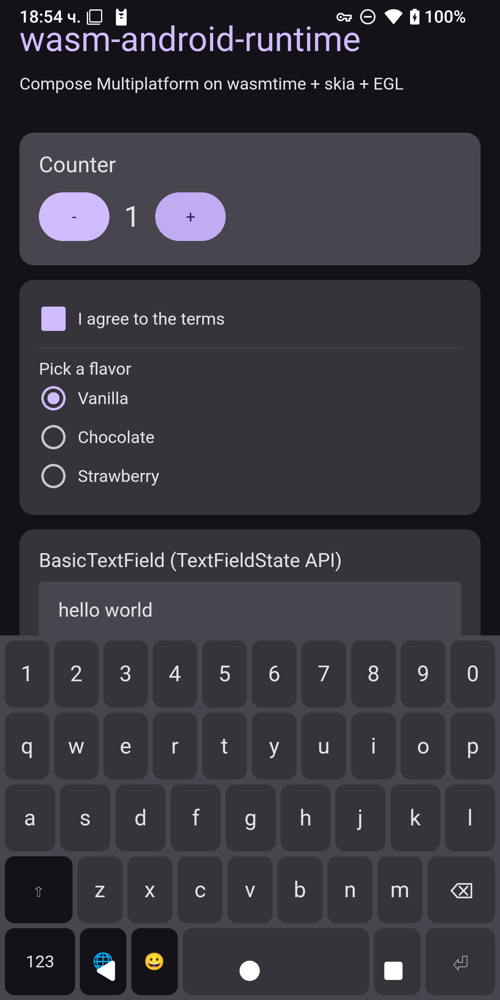
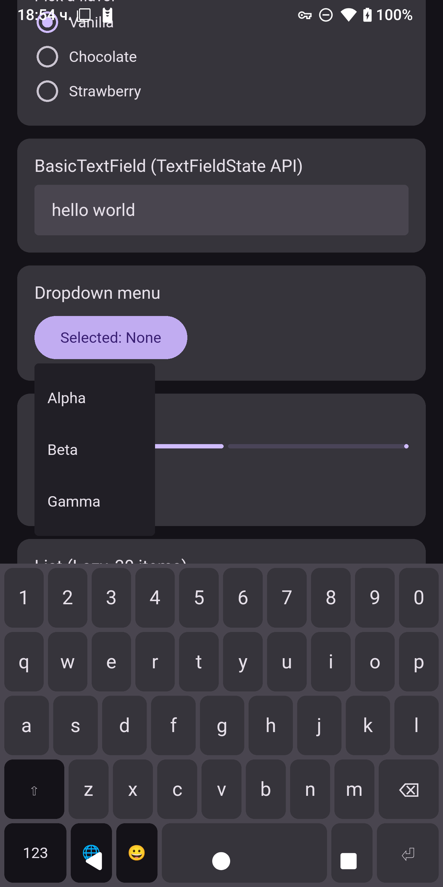
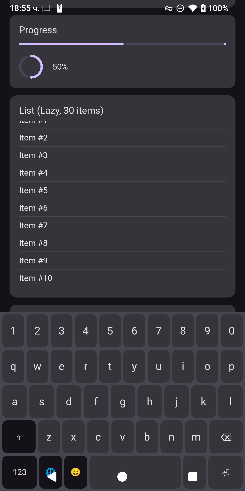
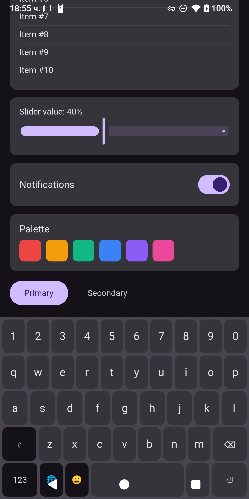

# wart-app

The reference Compose Multiplatform application for the **wasi-android-runtime**
(WAR) host. Built as a Kotlin/Wasm-WASI executable, packaged as a WebAssembly
Component, AOT-compiled for `aarch64-linux-android`, and executed inside the
custom wasmtime host that lives in `~/wart/wart-host/`.

## Screenshots

Running on a Pixel 2 XL (Android 15 / API 35). All UI is rendered by Compose
Multiplatform compiled to WebAssembly, drawn via skia-safe on the GPU through
EGL — no Android Views, no ART.

| | | | |
|:---:|:---:|:---:|:---:|
|  |  |  |  |
| Counter, Checkbox, RadioButtons, BasicTextField with in-canvas soft keyboard | DropdownMenu expanded, Slider | ProgressIndicator + LazyColumn (30 items, scrolling) | Slider, Switch, color palette, TabRow |

All widgets above are stock `androidx.compose.material3` / `androidx.compose.foundation` —
no app-specific custom drawing.

## What this app is for

This is the **canonical guest** used to exercise and regression-test every
piece of the runtime:

- The Kotlin/Wasm → WASI Preview 2 → wasmtime execution path
- The skiko-wasm-wasi WIT bindings (canvas, paint, path, text, shaders, image,
  gradients, color filters)
- The custom Compose runtime port (`compose-runtime-wasi`) and its
  `CanvasLayersComposeScene` glue
- All ported Compose modules: `ui`, `ui-graphics`, `ui-text`, `foundation`,
  `foundation-layout`, `animation`, `animation-core`, `material-ripple`,
  `material3`
- The host-side input pipeline: pointer events, hardware keyboard
  (`on-key-event-v2`), in-canvas soft keyboard, focus/lifecycle proxy events
- Host-side `WasiDrawable` transforms (translation/scale/rotation/clip/alpha)
- Warm-resume of the wasmtime store across activity suspend/resume

When something breaks on the runtime side, `wart-app` is where the breakage
shows up first.

## Code layout

```
src/wasmWasiMain/kotlin/
  Main.kt                         (entry point — registers RendererImpl)
  ComposeSmokeTest.kt             (the actual demo UI: TextField, Buttons,
                                   LazyColumn, scroll, Material3 widgets,
                                   DropdownMenu, soft-keyboard test)
  ComposeUiBaseSmokeTest.kt
  ComposeUiGraphicsSmokeTest.kt
  ComposeUiSmokeTest.kt
  ComposeFoundationSmokeTest.kt
  ComposeFoundationLayoutSmokeTest.kt
  ComposeAnimationCoreSmokeTest.kt
  ComposeMaterial3SmokeTest.kt
  ComposeMaterialRippleSmokeTest.kt
  compose/                        (test scenes per Compose feature)
```

Smoke-test files probe one Compose module each, so a compile failure points
straight at the offending ported klib.

## Relationship to the rest of `~/wart/`

| Path | Role |
|------|------|
| `wart-app/` (this) | The guest WASM Component / Compose UI |
| `host/` | The Rust wasmtime host — opens `skiko-component.cwasm`, owns the GPU surface, implements the WIT canvas/input/lifecycle imports |
| `wit/skiko-gfx.wit` | Source-of-truth WIT interface (mirrored in `skiko/skiko/wit/`) |
| `skiko/` (symlinked to `~/skiko`) | wasmWasi Skiko stubs + WIT-Kotlin bindings |
| `compose-multiplatform-core/` | In-tree port of the 13 real-source Compose modules + 16 compatibility-stub modules. Publishes 32 granular `*-wasm-wasi` klibs to `~/.m2`. |
| `compose-runtime-wasi/`, `compose-ui-wasi/`, `compose-foundation-wasi/`, ... (11 dirs) | "Sibling" fat-klib builds that **reuse the same source dirs** in `compose-multiplatform-core/` via `srcDirs`, but produce one klib per dir instead of one per module. Used as the linker fast path — see BUILD.md. |

## Build & run

See [BUILD.md](BUILD.md) for the end-to-end build, AOT, and deploy pipeline,
including the important note about why you should **never** depend directly on
the 32 granular klibs (linker takes 2+ hours) — depend on the 11 sibling fat
klibs instead (~5 minutes).
